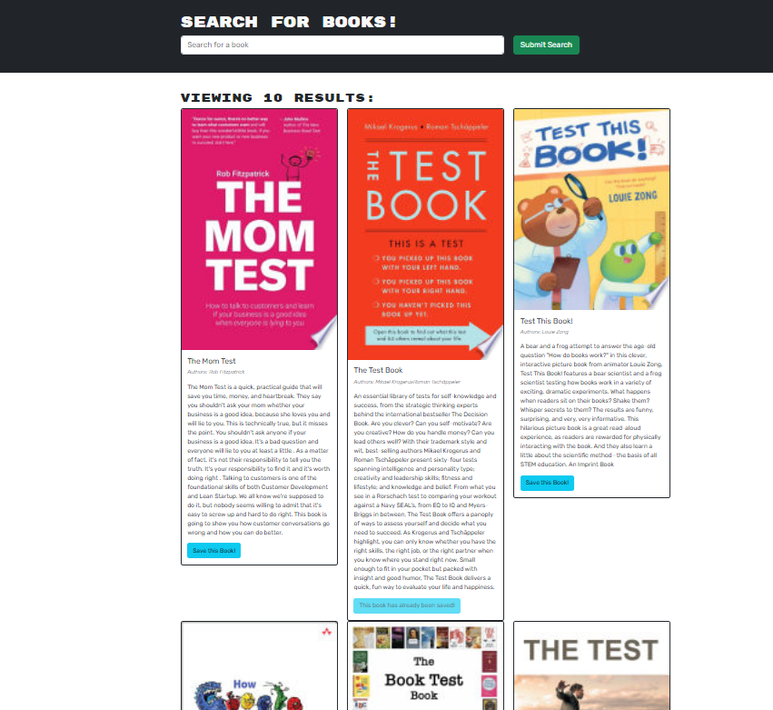

# Book Search Engine 
## Description

- this app allows users to search for books and save their favorites. The application uses the Google Books API for fetching book information and Apollo Client for managing GraphQL queries and mutations. Users can create an account, log in, and manage their saved book list.

## Table of Contents


- [Features](#features)
- [Installation](#installation)
- [Usage](#usage)
- [Link](#link)

## Features
- User Authentication: Register and log in with a secure JWT token system.
- Search Books: Search for books using the Google Books API.
- Save Books: Save books to a personalized list.(not working yet)
- Remove Books: Remove books from the saved list.(not working yet)
    
    
    
    

## Installation
- Go to the both client and server folders and run ``` npm i```
- then go to the top level of the project and type ``` npm run develop``` 
- it will open the browser automatically

## Usage
- API server running on port 3001
- Use GraphQL at http://localhost:3001/graphql

## Link
-repository URL : git@github.com:namahage1/Book-Search-Engine.git